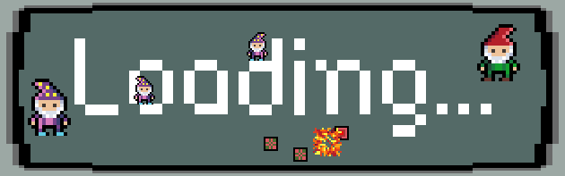

# Loading... 🎮

---

It’s him again! In front of your home this human appears! And with him soon again this pesky progress bar!

Fight the data packs with all you’ve got and prevent the loading bar reaching 100% AT ALL COST!

(oh and look out for your fellow gnomes, they try to have a nice day, too)

A game by: lupercalia & pixel-fabian

Created during [Ludum Dare 50 GameJam](https://ldjam.com/events/ludum-dare/50)

Build with [phaser 3](https://phaser.io/)

## Play

> Play on [itch.io](https://pixel-fabian.itch.io/loading)

### Controls:

- move: WASD or arrow keys
- interact: E or Q

## Edit or play localy

1. Clone or download this repository
2. Open `dist/index_standalone.html` with a webserver

## License

### Code

Loading... - A browser game -
Copyright (C) 2022 pixel-fabian & lupercalia

This program is free software: you can redistribute it and/or modify
it under the terms of the GNU General Public License as published by
the Free Software Foundation, either version 3 of the License, or
(at your option) any later version.

This program is distributed in the hope that it will be useful,
but WITHOUT ANY WARRANTY; without even the implied warranty of
MERCHANTABILITY or FITNESS FOR A PARTICULAR PURPOSE. See the
GNU General Public License for more details.

You should have received a copy of the GNU General Public License
along with this program. If not, see <https://www.gnu.org/licenses/>.

### Assets

- Sprites and sound effects: pixel-fabian & lupercalia CC-BY-SA 4.0
